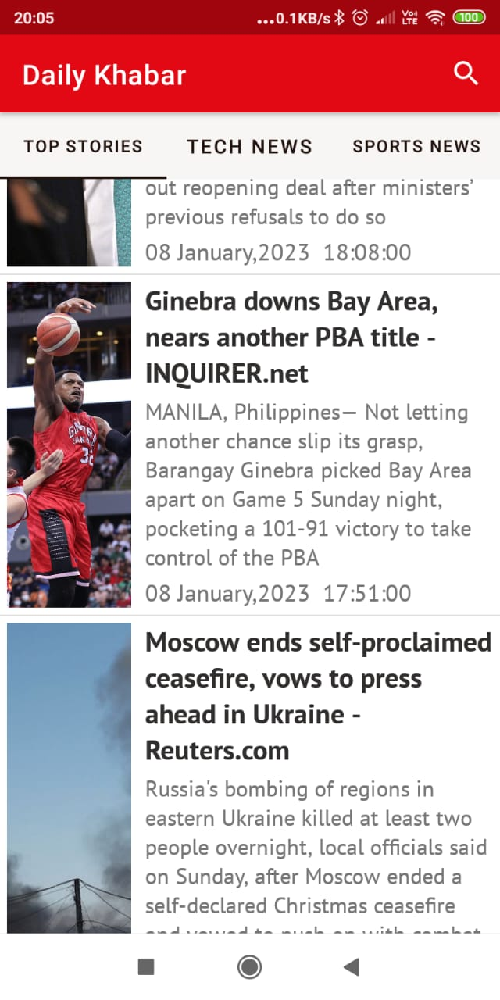
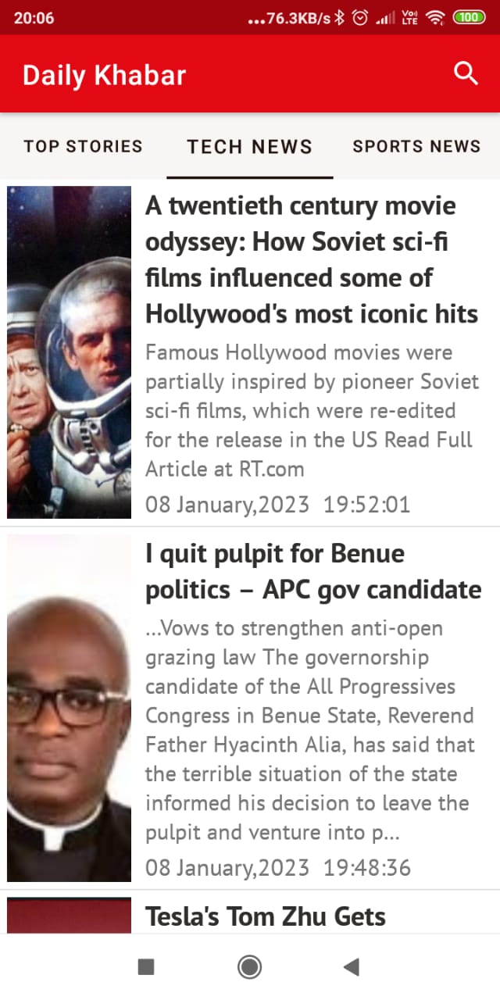
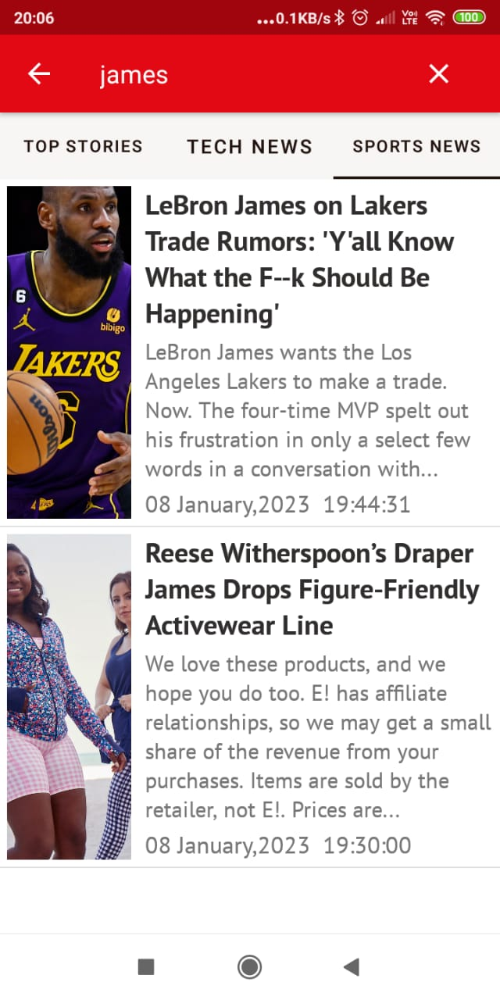
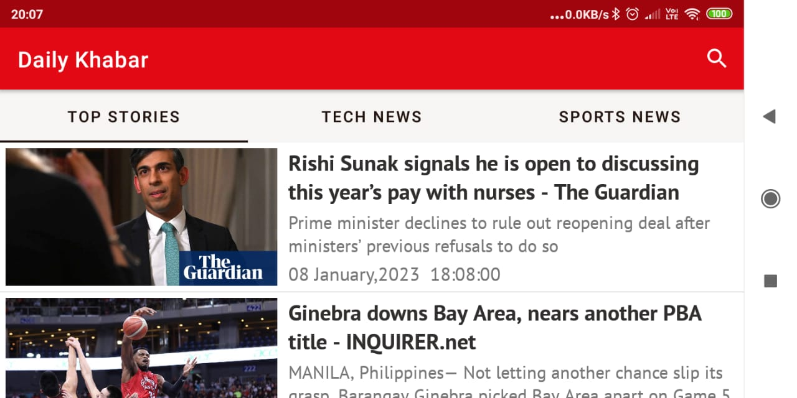

# Daily Khabar- An Android News Application

  

This is an Android news application which fetches news from an api and shows it in the app. You can search through the news items, see top headlines and search news across some prominent categories.

## Table of Contents
* [Introduction](#introduction)
* [Screenshots](#screenshots)
* [Demo and link to download the application](#demo-and-link-to-deployed-chat-application)
* [Features](#-features)
  * [Current features](#current-features)
  * [Feature request](#-feature-request)
* [Technologies and tools used](#technologies-and-tools-used)
* [Bug Reporting](#-bug-reporting)
* [License](#-license)
* [Note](#note)

## Introduction
There are various news apis available over the internet. But [newsapi.org](https://newsapi.org/) was the most interesting one i came across. Moreover it's free plan offered much more features compared to other apis so i thought of a developing an android application using this api. So i developed Daily Khabar ,an android news application showing live and dynamic news from the internet.

## Screenshots

  

    

   

   

## Demo and link to deployed chat application

  

You can download the android application apk file by clicking the below image <b>:</b>
 

 

## 🚀 Features
### Current features
* An user can see live news from over the internet.
* Filter for various ategories of news.
* Search specific news articles by entering keywords.

### ⭐ Feature request

* Any other feature you would like to suggest ,then please [open an issue](https://github.com/krishna-vasudev/DailyKhabar/issues) for that.😊
* Connect with me in [LinkedIn](www.linkedin.com/in/debraj-bhal-7597861b2). I did 💖 to hear how you feel using this app.
## Technologies and tools used
* [Anroid](https://developer.android.com/docs)
* [NewsApi.org](https://newsapi.org/)
* [Java](https://www.java.com/en/)

## 🐛 Bug Reporting
Feel free to [open an issue](https://github.com/krishna-vasudev/DailyKhabar/issues) on github if you find any bug.
## 📜 License
This software is open source, licensed under the [MIT License](/LICENSE).

## Note
Ping me in [LinkedIn](www.linkedin.com/in/debraj-bhal-7597861b2), if you want the source code.